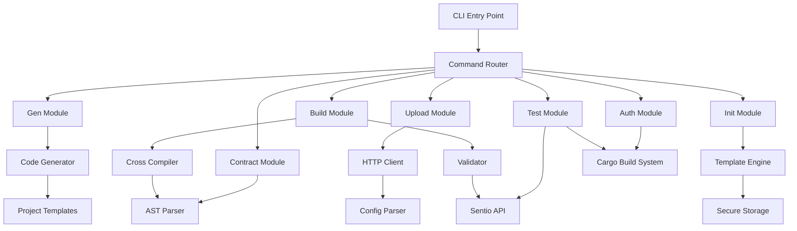

# Design Document

## Overview

The enhanced Sentio CLI will be a comprehensive command-line tool built in Rust using the `clap` crate for argument parsing. The CLI will be installable as a cargo subcommand, allowing users to invoke it with `cargo sentio <command>` in addition to the standalone `sentio <command>` usage. The CLI will provide a complete workflow for Sentio processor development, from project initialization to deployment. The design follows a modular architecture where each command is implemented as a separate module with clear separation of concerns.

## Architecture

### High-Level Architecture



### Module Structure

The CLI will be organized into the following modules:

- `main.rs` - Entry point and command routing (supports both `sentio` and `cargo-sentio` binaries)
- `commands/` - Individual command implementations
  - `build.rs` - Cross-compilation logic with integrated validation
  - `gen.rs` - Automated code generation utilities
  - `upload.rs` - Binary upload functionality
  - `init.rs` - Project initialization
  - `auth.rs` - Authentication management
  - `contract.rs` - Contract management
  - `test.rs` - Test execution and reporting
- `utils/` - Shared utilities
  - `config.rs` - Configuration management
  - `templates.rs` - Template handling
  - `api_client.rs` - Sentio API client
  - `storage.rs` - Secure credential storage
  - `validator.rs` - Project validation utilities
  - `test_runner.rs` - Test execution utilities

### Cargo Integration

The CLI will support installation as a cargo subcommand by:

1. **Dual Binary Setup:** Configure both `sentio` and `cargo-sentio` binaries in Cargo.toml
2. **Argument Handling:** Detect when invoked via `cargo sentio` and skip the first "sentio" argument
3. **Installation:** Users can install with `cargo install sentio-cli` and use `cargo sentio <command>`
4. **Discovery:** Cargo automatically discovers and makes available subcommands prefixed with `cargo-`

## Components and Interfaces

### Command Interface

All commands will implement a common `Command` trait:

```rust
#[async_trait]
pub trait Command {
    async fn execute(&self, args: &CommandArgs) -> Result<()>;
    fn validate_args(&self, args: &CommandArgs) -> Result<()>;
}
```

### Build Module

**Purpose:** Cross-compile Rust processors for Linux x86_64 target with integrated validation

**Key Components:**
- `CrossCompiler` - Handles cargo build with target specification
- `BuildConfig` - Manages build configuration and optimization flags
- `BinaryLocator` - Finds and validates generated binaries
- `ProjectValidator` - Validates project configuration and code before building

**Interface:**
```rust
pub struct BuildCommand {
    config: BuildConfig,
    validator: ProjectValidator,
}

pub struct BuildOptions {
    pub skip_validation: bool,
    pub target: String,
    pub optimization_level: String,
}

impl BuildCommand {
    pub async fn build_processor(&self, project_path: &Path, options: BuildOptions) -> Result<PathBuf>;
    pub async fn validate_and_build(&self, project_path: &Path, options: BuildOptions) -> Result<PathBuf>;
    pub fn validate_project(&self, project_path: &Path) -> Result<()>;
}
```

### Code Generation Module

**Purpose:** Automatically generate boilerplate code, handlers, and contract bindings for all contracts in the project

**Key Components:**
- `AutoGenerator` - Orchestrates automatic generation of handlers and bindings
- `HandlerGenerator` - Creates handler templates for contracts
- `ContractBindingGenerator` - Generates contract bindings from blockchain
- `TemplateEngine` - Processes code templates with variables

**Interface:**
```rust
pub struct GenCommand {
    template_engine: TemplateEngine,
    config: GenConfig,
}

pub struct GenConfig {
    pub generate_handlers: bool,
    pub generate_contracts: bool,
    pub target_contract: Option<String>,
}

impl GenCommand {
    pub async fn generate_all(&self, project_path: &Path) -> Result<()>;
    pub async fn generate_for_contract(&self, address: &str, project_path: &Path) -> Result<()>;
}
```

### Contract Management Module

**Purpose:** Manage contracts in the processor project configuration

**Key Components:**
- `ContractManager` - Handles adding/removing contracts from project
- `ContractValidator` - Validates contract addresses and fetches metadata
- `AbiResolver` - Fetches and stores contract ABIs

**Interface:**
```rust
pub struct ContractCommand {
    contract_manager: ContractManager,
    abi_resolver: AbiResolver,
}

impl ContractCommand {
    pub async fn add_contract(&self, address: &str, name: Option<&str>, network: Option<&str>) -> Result<()>;
    pub async fn remove_contract(&self, address: &str) -> Result<()>;
    pub async fn list_contracts(&self) -> Result<Vec<ContractInfo>>;
}
```

### Test Module

**Purpose:** Execute tests for Sentio processor projects with comprehensive reporting

**Key Components:**
- `TestRunner` - Orchestrates test execution using cargo test
- `TestReporter` - Formats and displays test results
- `TestFilter` - Handles test filtering and selection

**Interface:**
```rust
pub struct TestCommand {
    test_runner: TestRunner,
    reporter: TestReporter,
}

pub struct TestOptions {
    pub filter: Option<String>,
    pub release_mode: bool,
    pub verbose: bool,
}

impl TestCommand {
    pub async fn run_tests(&self, project_path: &Path, options: TestOptions) -> Result<TestResults>;
    pub async fn run_filtered_tests(&self, project_path: &Path, filter: &str) -> Result<TestResults>;
}
```

### Upload Module

**Purpose:** Upload compiled binaries to Sentio platform

**Key Components:**
- `SentioApiClient` - HTTP client for Sentio API
- `BinaryUploader` - Handles file upload with progress tracking
- `AuthenticationManager` - Manages API credentials

**Interface:**
```rust
pub struct UploadCommand {
    api_client: SentioApiClient,
    auth_manager: AuthenticationManager,
}

impl UploadCommand {
    pub async fn upload_binary(&self, binary_path: &Path) -> Result<UploadResponse>;
    pub async fn authenticate(&self) -> Result<()>;
}
```

### Authentication Module

**Purpose:** Manage Sentio platform credentials securely

**Key Components:**
- `CredentialStore` - Secure local storage for API keys
- `AuthFlow` - Handle login/logout flows
- `TokenValidator` - Validate and refresh tokens

**Interface:**
```rust
pub struct AuthCommand {
    credential_store: CredentialStore,
}

impl AuthCommand {
    pub async fn login(&self, api_key: &str) -> Result<()>;
    pub async fn logout(&self) -> Result<()>;
    pub async fn status(&self) -> Result<AuthStatus>;
}
```

## Data Models

### Project Configuration

```rust
#[derive(Serialize, Deserialize)]
pub struct SentioConfig {
    pub name: String,
    pub version: String,
    pub target_network: String,
    pub contracts: Vec<ContractConfig>,
    pub build: BuildConfig,
}

#[derive(Serialize, Deserialize)]
pub struct ContractConfig {
    pub address: String,
    pub name: String,
    pub network: String,
    pub abi_path: Option<String>,
    pub added_at: String,
}

#[derive(Serialize, Deserialize)]
pub struct ContractInfo {
    pub address: String,
    pub name: String,
    pub network: String,
    pub has_abi: bool,
    pub handler_generated: bool,
}

#[derive(Serialize, Deserialize)]
pub struct BuildConfig {
    pub target: String,
    pub optimization_level: String,
    pub features: Vec<String>,
}
```

### API Models

```rust
#[derive(Serialize, Deserialize)]
pub struct UploadRequest {
    pub binary_data: Vec<u8>,
    pub processor_name: String,
    pub version: String,
    pub target_network: String,
}

#[derive(Serialize, Deserialize)]
pub struct UploadResponse {
    pub deployment_id: String,
    pub status: String,
    pub url: String,
}
```

## Error Handling

The CLI will use a comprehensive error handling strategy:

1. **Custom Error Types:** Define specific error types for each module
2. **Error Context:** Use `anyhow` for error context and chaining
3. **User-Friendly Messages:** Convert technical errors to actionable user messages
4. **Exit Codes:** Use appropriate exit codes for different error conditions

```rust
#[derive(Debug, thiserror::Error)]
pub enum CliError {
    #[error("Build failed: {0}")]
    BuildError(String),
    
    #[error("Upload failed: {0}")]
    UploadError(String),
    
    #[error("Authentication failed: {0}")]
    AuthError(String),
    
    #[error("Project validation failed: {0}")]
    ValidationError(String),
}
```

## Testing Strategy

### Unit Testing
- Test each command module independently
- Mock external dependencies (API calls, file system operations)
- Test error conditions and edge cases
- Validate argument parsing and validation logic

### Integration Testing
- Test complete command workflows
- Test with real project structures
- Validate cross-compilation process
- Test API integration with mock servers

### End-to-End Testing
- Test complete user workflows from init to deploy
- Test with real Sentio API (in staging environment)
- Validate generated project structures
- Test error recovery scenarios

### Test Structure
```rust
#[cfg(test)]
mod tests {
    use super::*;
    use tempfile::TempDir;
    
    #[tokio::test]
    async fn test_build_command_success() {
        // Test successful build
    }
    
    #[tokio::test]
    async fn test_build_command_invalid_project() {
        // Test error handling
    }
}
```

## Configuration Management

The CLI will support multiple configuration sources and work seamlessly with cargo:

1. **Global Config:** `~/.sentio/config.toml` for user-wide settings
2. **Project Config:** `sentio.toml` in project root for project-specific settings
3. **Cargo Integration:** Detect cargo workspace and project structure automatically
4. **Environment Variables:** For CI/CD and deployment scenarios
5. **Command Line Arguments:** For one-time overrides

Configuration precedence (highest to lowest):
1. Command line arguments
2. Environment variables
3. Project configuration file
4. Global configuration file
5. Cargo workspace detection
6. Default values

### Cargo Subcommand Integration

```rust
// Handle both direct invocation and cargo subcommand
fn parse_args() -> Cli {
    let mut args: Vec<String> = std::env::args().collect();
    
    // If invoked as `cargo sentio`, remove the "sentio" argument
    if args.len() > 1 && args[1] == "sentio" {
        args.remove(1);
    }
    
    Cli::parse_from(args)
}
```

## Security Considerations

1. **Credential Storage:** Use OS-specific secure storage (Keychain on macOS, Credential Manager on Windows, Secret Service on Linux)
2. **API Communication:** Use HTTPS for all API communications
3. **Input Validation:** Validate all user inputs to prevent injection attacks
4. **File Permissions:** Set appropriate permissions on generated files and directories
5. **Temporary Files:** Securely handle and clean up temporary files during build process

## Performance Considerations

1. **Parallel Processing:** Use async/await for I/O operations
2. **Caching:** Cache compiled dependencies and generated code
3. **Progress Indicators:** Show progress for long-running operations
4. **Resource Management:** Properly manage memory and file handles
5. **Build Optimization:** Use incremental compilation where possible